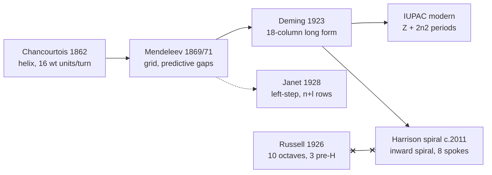

# Russell's 1926 chart against other periodic systems

Prepared 2026-09-11 (project item R19); every retrieval recorded below carries the same date.
This document sets Walter Russell's periodic chart of *The Universal One* beside five other
periodic systems and records, for each, its primary sources, its organising principle, and what
it successfully predicted. It supports the comparative entries in `data/scoreboard.json`.

This document is not part of the site navigation. It is reached by citation, and it stands on its
own: everything needed to read it is here. Every statement is either a measured fact or a marked
[INFERENCE]. The document reaches no verdicts; the verdict vocabulary and the scoring rules are
in `data/verdict_taxonomy.md` (project item R18). The comparison table behind this
document is published beside it as `data/comparison.tsv`.

No image from spiralperiodictable.com is stored anywhere in this repository (project rule S13);
the site is cited and described in text only. The HTML text of four of its pages was captured for
the citation check and kept in `data/comparison_site_capture/`, which is private working staging
and is not published. Those files contain no image data.

## 1. The five comparison systems

### 1.1 de Chancourtois — vis tellurique (1862)
- **Primary source:** A.-E. Béguyer de Chancourtois, "Mémoire sur un classement naturel des corps simples ou radicaux, appelé vis tellurique", *Comptes rendus hebdomadaires des séances de l'Académie des sciences* **54** (1862) 757–761, with continuations at pp. 840–843 and 967–971. Transcription: https://fr.wikisource.org/wiki/Comptes_rendus_de_l%E2%80%99Acad%C3%A9mie_des_sciences/Tome_54,_1862/21_avril (retrieved 2026-09-11). Secondary: Linda Hall Library, https://www.lindahall.org/about/news/scientist-of-the-day/alexandre-emile-beguyer-de-chancourtois/ (retrieved 2026-09-11).
- **Organising principle:** atomic weight plotted along a helix on a cylinder whose circumference is 16 units (≈ atomic weight of oxygen); one turn = 16 weight units; similar elements align on vertical generator lines (O above S).
- **Successful predictions:** the first published statement that properties recur periodically with atomic weight. No confirmed new-element predictions. The Comptes rendus printing omitted the folding diagram, which crippled its reception.

### 1.2 Mendeleev (1869 and 1871)
- **Primary sources:** "Sootnoshenie svoistv s atomnym vesom elementov", *Zhurnal Russkogo Khimicheskogo Obshchestva* **1** (1869) 60–77; German abstract *Zeitschrift für Chemie* **12** (1869) 405–406; "Die periodische Gesetzmässigkeit der chemischen Elemente", *Annalen der Chemie und Pharmacie*, Supplementband **8** (1871) 133–229. English translation of the 1871 paper with full bibliography: https://web.lemoyne.edu/giunta/ea/mendeleevann.html (retrieved 2026-09-11); 1869 record: https://www.historyofinformation.com/detail.php?id=2898 (retrieved 2026-09-11).
- **Organising principle:** atomic-weight order; properties a periodic function of weight; deliberate gaps with *quantitative* property predictions for the missing members.
- **Successful predictions (the gold standard):** eka-aluminium → **gallium** (Lecoq de Boisbaudran, 1875); eka-boron → **scandium** (Nilson, 1879); eka-silicon → **germanium** (Winkler, 1886). Predicted atomic weight, density, and oxide chemistry matched measurement. Also corrected accepted atomic weights (Be, U).

### 1.3 Janet left-step (1928/29)
- **Primary source:** Charles Janet, *Essais de classification hélicoïdale des éléments chimiques*, Beauvais: Imprimerie départementale de l'Oise, November 1928 (79 pp. + folding tables) — HathiTrust record https://catalog.hathitrust.org/Record/006098575 (retrieved 2026-09-11). English summary: "The helicoidal classification of the elements", *Chemical News* **138** (1929) 372–374, 388–393. Modern assessment: P. J. Stewart, "Charles Janet: unrecognized genius of the periodic system", *Foundations of Chemistry* **12** (2010) 5–15, https://link.springer.com/article/10.1007/s10698-008-9062-5 (retrieved 2026-09-11).
- **Organising principle:** strict atomic-number order, rows defined by the n+l value of the filling subshell (row lengths 2,2,8,8,18,18,32,32); s-block on the right; He above Be; derived from an underlying helix.
- **Successful predictions:** anticipated the Madelung (n+l, then n) filling rule eight years before Madelung's 1936 statement, from table regularity alone; ended his table at Z=120, still the expected close of the period-8 s-block. [INFERENCE: "anticipation" framing follows Stewart 2010.]

### 1.4 Modern IUPAC table
- **Primary sources:** foundations — H. G. J. Moseley, "The High-Frequency Spectra of the Elements", *Phil. Mag.* ser. 6, **26** (1913) 1024–1034 and Part II **27** (1914) 703–713 (full 1913 text: https://www.chemteam.info/Chem-History/Moseley-article.html, retrieved 2026-09-11); current authority — IUPAC Periodic Table of the Elements, https://iupac.org/what-we-do/periodic-table-of-elements/ (retrieved 2026-09-11).
- **Organising principle:** atomic number Z (nuclear charge measured by Moseley's X-ray law) plus quantum-mechanical electron configuration; 18-column long form; period lengths 2,8,8,18,18,32,32 from 2n² shell capacities.
- **Successful predictions:** Moseley's sequence fixed the gaps Z = 43, 61, 72, 75 — all confirmed: Hf (Coster & Hevesy, 1923), Re (Noddack, Tacke & Berg, 1925), Tc (Perrier & Segrè, 1937), Pm (Marinsky, Glendenin & Coryell, 1945). The quantum framework predicted period 7 closing at Z=118, confirmed with oganesson (IUPAC verification 2015, named 2016).

### 1.5 Harrison spiral (Deming-based)
- **Primary source:** Robert W. Harrison, "The Spiral Periodic Table", https://spiralperiodictable.com/ (retrieved 2026-09-11; earliest Wayback capture 2011-04-08, timestamp 20110408102358; the site's own comparison table dates the design "2000s"). Formal write-up: Harrison, *The Spiral Periodic Table – Why Process Reveals What Classification Obscures*, preprint (not peer reviewed), February 2026, Zenodo DOI 10.5281/zenodo.18078776. Stated historical foundation: H. G. Deming, *General Chemistry: An Elementary Survey*, New York: John Wiley & Sons, 1923 (18-column form; A/B subgroups; Group VIII conceptually linked to Group 0).
- **Organising principle:** continuous spiral by atomic number, lighter elements on the outer rim winding inward to heavier at the centre; 8 main-group (A) spokes, transition metals as an inner coil of 8 B-subgroups; Deming's Group VIIIB aligned radially with Group 0 via the 18-electron rule (metal carbonyls Fe(CO)₅, Ni(CO)₄, Cr(CO)₆); period lengths presented as 2n². Licensed CC BY-SA 4.0 (per site footer). The site presents the table inside its author's own research program on "hydrodynamic quantum gravity" and a non-viscous ether (site title: "Our Electric Universe… & Anti-Gravity"). That is stated as a fact about the publication context; this document makes no assessment of it.
- **Successful predictions:** none documented. The design re-visualises established chemistry (18-electron rule of the Langmuir 1921 / Sidgwick 1923 lineage; 2n² capacities from quantum mechanics). The preprint page expressly states that it "does not claim to replace the conventional periodic table".

## 2. Positioning claim: does spiralperiodictable.com cite Russell?

**Finding: the site's authored content cites Russell nowhere. Russell appears only in visitor comments — and Harrison's own reply explicitly denies Russell as an inspiration.** The precise form matters: "cites Russell nowhere" is true of everything Harrison wrote as content; the comment thread on the home page does contain the name, introduced by visitors, and answered by Harrison with a denial. Detail:

- **Pages checked** (live fetch, 2026-09-11; HTML kept in `data/comparison_site_capture/`, which is private working staging and is not published):
  1. `https://spiralperiodictable.com/` (home — the full spiral-table article)
  2. `https://spiralperiodictable.com/core-concepts/`
  3. `https://spiralperiodictable.com/research-preprints-technical-papers/`
  4. `https://spiralperiodictable.com/research-preprints-technical-papers/preprint-the-spiral-periodic-table/`
- **Exact check performed:** case-insensitive regex search for `russell` over the fetched raw HTML of all four pages (grep over `data/comparison_site_capture/*.html`).
- **Result:** zero matches in pages 2–4. All matches on page 1 fall inside the reader-comment markup, not the article:
  - Comment #856 on the home page of spiralperiodictable.com (Jason, 2012-03-26): "Looks like someone is finally listening to Walter Russell from 1926… Hope the illustrator gives the credit where it's due." The ellipsis elides two sentences: that Russell was ignored, and that Tesla told him to lock his ideas away for the next 1,000 years. That story circulates in Russell-adjacent spaces. It appears here only as a quoted visitor comment and is not adopted.
  - Harrison's reply #858 in the same thread on spiralperiodictable.com (2012-03-26), quoted in full and verbatim: **"Walter Russell's PT was not an inspiration for my table. I have given credit to any source of inspiration. Russell's PT is broken up into 16 segments, mine 8. His PT starts from the inside and spirals out, mine spirals inwards representing the increasing density of movement and matter."**
  - Comment #3944 (mike, 2013-04-06): "Your tables missing the first three octaves before Hydrogen, only 21 elements, as in Walter russells table the only true table."
  - Comment #4851 ("b", 2013-09-11): "walter russell".
- **The site's own history section** ("Historical Context: The Deming Foundation") and its comparison table credit **Chancourtois (1862), Mendeleev (1869), Deming (1923), Janet (1928), Benfey (1964), Harrison (2000s)** — Russell absent.
- **Dated Wayback captures requested via `https://web.archive.org/save/` on 2026-09-11 (all HTTP 200):**
  - Home: https://web.archive.org/web/20260911154603/https://spiralperiodictable.com/
  - Core Concepts: https://web.archive.org/web/20260911154626/https://spiralperiodictable.com/core-concepts/
  - Research & Preprints: https://web.archive.org/web/20260911154753/https://spiralperiodictable.com/research-preprints-technical-papers/
  - Preprint page: https://web.archive.org/web/20260911154924/https://spiralperiodictable.com/research-preprints-technical-papers/preprint-the-spiral-periodic-table/
- Earliest snapshot on record: 2011-04-08 (`web.archive.org/web/20110408102358/http://spiralperiodictable.com/`).

[INFERENCE] Any claim that Harrison's spiral "vindicates" or "descends from" Russell is contradicted by the designer's own on-record statement and by the site's stated lineage (Deming 1923). Harrison's description of Russell's chart ("16 segments… starts from the inside and spirals out") is his characterisation; the LoC chart itself shows 8 named tone-lines mirrored across the equilibrium axis (16 radial half-lines if both halves are counted), so his "16" is defensible as a count of half-lines — noted to avoid overreading his reply as an error.

## 3. Russell 1926 against each system — structural facts only

Source for Russell's structure: LoC gdc.27004508 image 0016 (chart) and the book's "Table of the Ten Octaves" pages (book p. 92 ff.; OCR fulltext lines ~10460–11260 of `source_scans/loc/loc_fulltext.txt`, which is private working staging and is not published). Key measured facts:

- **Octave count:** ten octaves of seven tones each ("there are ten octaves of seven tones each"; "Four units = one octave / Ten octaves = one cycle"); mid-tones intrude from the seventh octave onward ("Mid-tones begin in the seventh octave").
- **Hydrogen:** "Tone 4o1+ is hydrogen. It is the first + element of the fourth octave." Three full octaves of coined, unobserved elements precede hydrogen (Alphanon, Betanon, Gammanon, Hydron, etc.); the chart's central axis reads Omeganon–Xenon–Argon–Helium–Gammanon–Alphanon–[centre]–Betanon–Hydron–Neon–Krypton–Niton. Russell also asserts an undiscovered "helionon" (401−) as hydrogen's "true tonal mate".
- **Inert gases:** placed at the "0=" equilibrium positions on the "LINE OF THE INERT GASES / EQUILIBRIUM LINE"; each octave ends and the next begins at an inert gas — they are octave *boundaries/seed points*, not a terminal column.

Per-system contrasts (fact-level):

| vs | Structural agreement | Structural disagreement |
|---|---|---|
| **Chancourtois 1862** | Both helical/cyclic; both place recurrence on geometric alignment | Chancourtois' turn is a fixed 16 atomic-weight units and contains only known elements; Russell's octaves are not tied to a weight metric and 3 of 10 octaves are entirely unobserved coined elements |
| **Mendeleev 1869/1871** | Both leave gaps for undiscovered elements | Mendeleev's gaps are interpolations *inside* the measured weight sequence with numeric property predictions, confirmed within 17 years; Russell's principal gaps lie *before* hydrogen, carry no quantitative properties, and none has been confirmed |
| **Janet 1928/29** | Both impose a regularised, symmetric scheme going beyond the empirical table; both derive from a helix | Janet's row lengths follow 2,2,8,8,18,18,32,32 (n+l), matching later quantum mechanics; Russell's ten uniform 7-tone octaves conflict with the unequal 2n² period lengths |
| **Modern IUPAC** | Periodicity itself; inert gases as closure points of a cycle | IUPAC: 7 periods, 118 confirmed elements, nothing below Z=1 (Z is nuclear charge; a "pre-hydrogen element" would need Z<1); noble gases *end* periods as a right-hand group; Russell: 10 octaves, ~21 unobserved pre-hydrogen entries, inert gases at octave centres/starts on an equilibrium axis |
| **Harrison spiral** | Both are spiral renderings with radial recurrence lines | Harrison: 8 spokes, spirals *inward* from H on the outer rim, contains exactly the 118 accepted elements, nothing before hydrogen; Russell: mirrored tone-lines about an equilibrium axis, runs *outward* from the centre per Harrison's own description, pre-hydrogen octaves included. Designer's on-record statement: Russell was not an inspiration (comment #858, 2012-03-26) |

Structural relationship sketch (rows = cycle boundaries):

## 4. Open points

- Deming 1923 is cited here through Harrison's site description of the 18-column form and through standard bibliography (Wiley, 1923). No page-level citation to Deming is given; the book is on HathiTrust and archive.org if one is ever wanted. None of the comparisons above rests on it.
- The Tesla story about sealing the knowledge for 1,000 years appears in comment #856 on Harrison's site. It is recorded here as an example of a claim circulating in Russell-adjacent spaces. It is not a fact and is not presented as one.
- No Harrison imagery was downloaded or stored. The only local material from the site is text-only HTML under `data/comparison_site_capture/`, which is private working staging and is not published.
